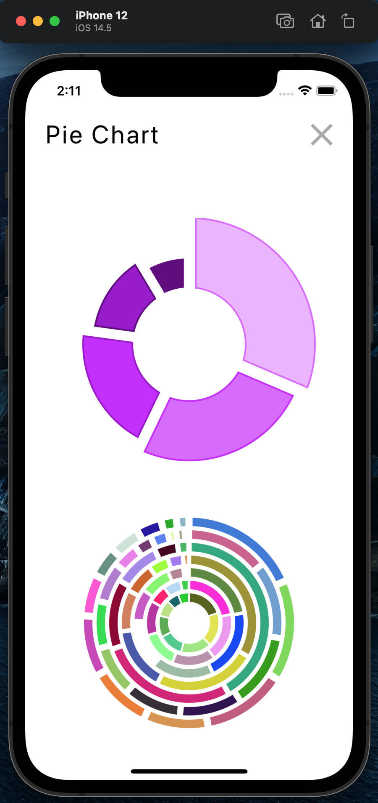

# React native charts library

## Made with React Native, Typescript, React native svg, React native svg charts

---

### Description

This app is a part of an article  
[Make your custom charts with react-native-svg-charts and typescript. Step-by-step tutorial](https://thewidlarzgroup.com/rn-svg-charts-ts/)

---

### Installation:

- [ ] Clone the repo
- [ ] Run `yarn` from the root
- [ ] Run `cd ios && pod install && cd ..`
- [ ] Run the metro with `yarn start`
- [ ] Open the app either in a simulator with `yarn ios` / `yarn android` or on a physical device
- [ ] Use the examples in your project :smile:

---

## Table of Contents

- **[React-native-svg-charts setup](https://thewidlarzgroup.com/rn-svg-charts-ts/#react-native-svg-charts-setup)**
- **[Area chart](https://thewidlarzgroup.com/rn-svg-charts-ts/#area-chart)**
    - **[Base example with props and typescript](https://thewidlarzgroup.com/rn-svg-charts-ts/#base-example-with-props-and-typescript)**
    - **[Line with circle decorators and grid](https://thewidlarzgroup.com/rn-svg-charts-ts/#line-with-circle-decorators-and-grid)**
    - **[Start props](https://thewidlarzgroup.com/rn-svg-charts-ts/#start-props)**
    - **[Curve and gradient](https://thewidlarzgroup.com/rn-svg-charts-ts/#curve-and-gradient)**
    - **[Multiple areas on the one chart](https://thewidlarzgroup.com/rn-svg-charts-ts/#multiple-areas-on-the-one-chart)**
    - **[Area chart props summary](https://thewidlarzgroup.com/rn-svg-charts-ts/#area-chart-props-summary)**
    - **[Stacked area chart](https://thewidlarzgroup.com/rn-svg-charts-ts/#stacked-area-chart)**

- **[Bar chart](https://thewidlarzgroup.com/rn-svg-charts-ts/#bar-chart)**
    - **[Basic Bar chart](https://thewidlarzgroup.com/rn-svg-charts-ts/#basic-bar-chart)**
    - **[Spacing and gradient](https://thewidlarzgroup.com/rn-svg-charts-ts/#spacing-and-gradient)**
    - **[yAccessor and different bar colors](https://thewidlarzgroup.com/rn-svg-charts-ts/#yAccessor-and-different-bar-colors)**
    - **[Dashed bars](https://thewidlarzgroup.com/rn-svg-charts-ts/#dashed-bars)**
    - **[Grades](https://thewidlarzgroup.com/rn-svg-charts-ts/#grades)**
    - **[Horizontal Bar chart](https://thewidlarzgroup.com/rn-svg-charts-ts/#horizontal-bar-chart)**
    - **[Bar chart props summary](https://thewidlarzgroup.com/rn-svg-charts-ts/#bar-chart-props-summary)**
    - **[Stacked Bar chart](https://thewidlarzgroup.com/rn-svg-charts-ts/#stacked-bar-chart)**

- **[Line chart](https://thewidlarzgroup.com/rn-svg-charts-ts/#line-chart)**
    - **[Basic Line chart](https://thewidlarzgroup.com/rn-svg-charts-ts/#basic-line-chart)**
    - **[Line shadow](https://thewidlarzgroup.com/rn-svg-charts-ts/#line-shadow)**
    - **[Line round shape with grid and gradient](https://thewidlarzgroup.com/rn-svg-charts-ts/#line-round-shape-with-grid-and-gradient)**
    - **[Line steps shape](https://thewidlarzgroup.com/rn-svg-charts-ts/#line-steps-shape)**
    - **[Partial line with the shadow](https://thewidlarzgroup.com/rn-svg-charts-ts/#partial-line-with-the-shadow)**
    - **[Multiple lines chart](https://thewidlarzgroup.com/rn-svg-charts-ts/#multiple-lines-chart)**
    - **[Line chart with average](https://thewidlarzgroup.com/rn-svg-charts-ts/#line-chart-with-average)**
    - **[Line chart props summary](https://thewidlarzgroup.com/rn-svg-charts-ts/#line-chart-props-summary)**

- **[Pie chart](https://thewidlarzgroup.com/rn-svg-charts-ts/#pie-chart)**
    - **[Pie chart data](https://thewidlarzgroup.com/rn-svg-charts-ts/#pie-chart-data)**
    - **[Basic Pie chart](https://thewidlarzgroup.com/rn-svg-charts-ts/#basic-pie-chart)**
    - **[Inner radius wth pad angle and sort](https://thewidlarzgroup.com/rn-svg-charts-ts/#inner-radius-with-pad-angle-and-sort)**
    - **[Corner radius and labels](https://thewidlarzgroup.com/rn-svg-charts-ts/#corner-radius-and-labels)**
    - **[Slice outer radius](https://thewidlarzgroup.com/rn-svg-charts-ts/#slice-outer-radius)**
    - **[Nested pie charts](https://thewidlarzgroup.com/rn-svg-charts-ts/#nested-pie-charts)**
    - **[Pie chart props summary](https://thewidlarzgroup.com/rn-svg-charts-ts/#pie-chart-props-summary)**

- **[Progress circle](https://thewidlarzgroup.com/rn-svg-charts-ts/#progress-circle)**
    - **[Basic progress circle](https://thewidlarzgroup.com/rn-svg-charts-ts/#basic-progress-circle)**
    - **[Start angle and end angle](https://thewidlarzgroup.com/rn-svg-charts-ts/#start-angle-and-end-angle)**
    - **[Progress number corner radius and stroke width](https://thewidlarzgroup.com/rn-svg-charts-ts/#progress-number-corner-radius-and-stroke-width)**
    - **[Combine stroke width with the angles and text - Speedometer](https://thewidlarzgroup.com/rn-svg-charts-ts/#combine-stroke-width-with-the-angles-and-text---speedometer)**
    - **[Nested multiple progress circles](https://thewidlarzgroup.com/rn-svg-charts-ts/#nested-multiple-progress-circles)**
    - **[Colored bows](https://thewidlarzgroup.com/rn-svg-charts-ts/#colored-bows)**
    - **[Pac-man](https://thewidlarzgroup.com/rn-svg-charts-ts/#pac---man)**
    - **[Progress circle props summary](https://thewidlarzgroup.com/rn-svg-charts-ts/#basic-progress-circle)**

- **[Axes](https://thewidlarzgroup.com/rn-svg-charts-ts/#progress-circle)**
    - **[Axis Y](https://thewidlarzgroup.com/rn-svg-charts-ts/#axis-y)**
    - **[Axis Y Line](https://thewidlarzgroup.com/rn-svg-charts-ts/#axis-y-line)**
    - **[Axis X](https://thewidlarzgroup.com/rn-svg-charts-ts/#axis-x)**
    - **[Axis X Line](https://thewidlarzgroup.com/rn-svg-charts-ts/#axis-x-line)**
    - **[Both Axes](https://thewidlarzgroup.com/rn-svg-charts-ts/#both-axes)**

- **[Summary](https://thewidlarzgroup.com/rn-svg-charts-ts/#summary)**

